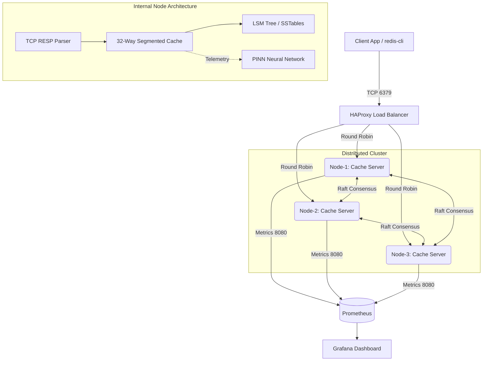

# Distributed ML-Powered Cache System 🚀

A highly-available, distributed caching system written in C++ that achieves **1.8+ Million Requests Per Second (RPS)** locally. It features a custom Log-Structured Merge (LSM) tree storage engine, 3-Node Raft consensus clustering, and an integrated Physics-Informed Neural Network (PINN) that dynamically predicts cache hotspots in real-time.

## 🌟 Key Features

- **Extreme Throughput:** Achieves **1.81M+ RPS** via a heavily optimized, 32-way lock-striped concurrent architecture and pipelined RESP processing.
- **Distributed Architecture:** A **3-Node Raft Consensus** cluster guarantees high availability. All nodes sit behind an **HAProxy** TCP load balancer for seamless client routing.
- **LSM-Tree Storage Engine:** Custom-built persistent backend utilizing Memtables, Write-Ahead Logs (WAL), and SSTables on disk, preventing data loss upon restart.
- **Machine Learning Integration:** A live Physics-Informed Neural Network (PINN) runs in a background thread, constantly training on internal memory segment telemetry to predict hotspots and recommend cache shard migrations.
- **Full Observability:** Deep integration with **Prometheus** and **Grafana**, exposing real-time metrics for cache hits/misses, LSM compactions, and ML Neural Network training loss.

## 🏗️ Architecture



## 🚀 Getting Started

The entire architecture is fully containerized. You do not need to build the C++ source code manually to run the cluster.

### Prerequisites
- [Docker](https://www.docker.com/) and `docker-compose`

### Deployment
1. Clone the repository and navigate into the project directory.
2. Spin up the cluster, HAProxy, and monitoring stack:
   ```bash
   docker-compose up -d --build
   ```
3. Open **Grafana** in your browser to view the live dashboard:
   ```text
   http://localhost:3000
   ```
   *(Navigate to Dashboards > Distributed Cache System)*

## 📊 Dashboard & Observability

The system exposes rich, real-time metrics scraped via Prometheus and visualized in Grafana. The dashboard tracks:
- **Throughput & Cache Hit Ratio**
- **Raft Consensus Node Status**
- **LSM-Tree On-Disk Compactions**
- **PINN Neural Network Training Loss & Shard Migrations**

<div align="center">
  
  <br>
  <em>(Upload your Grafana screenshot to your repository and replace the URL above)</em>
</div>

## ⚡ Load Testing & Benchmarking

Because this cache server uses the Redis Serialization Protocol (RESP), you can benchmark it using standard Redis tools.

Run the following command to launch a heavy, multi-threaded pipelined load test against the cluster:

```bash
docker run --rm --network distributedcachesystem_default redis redis-benchmark -h haproxy -p 6379 -a MySuperSecret -c 1000 -n 2000000 --threads 8 -P 500 -t set,get
```
*Observe the Grafana dashboard during the test to watch the cluster scale and the Neural Network loss curve decay.*

## 🛠️ Tech Stack
- **Core:** C++17, Multithreading, Sockets
- **Consensus:** Raft Protocol Implementation
- **Machine Learning:** Custom C++ Physics-Informed Neural Network (PINN)
- **Infrastructure:** Docker, HAProxy
- **Observability:** Prometheus, Grafana
