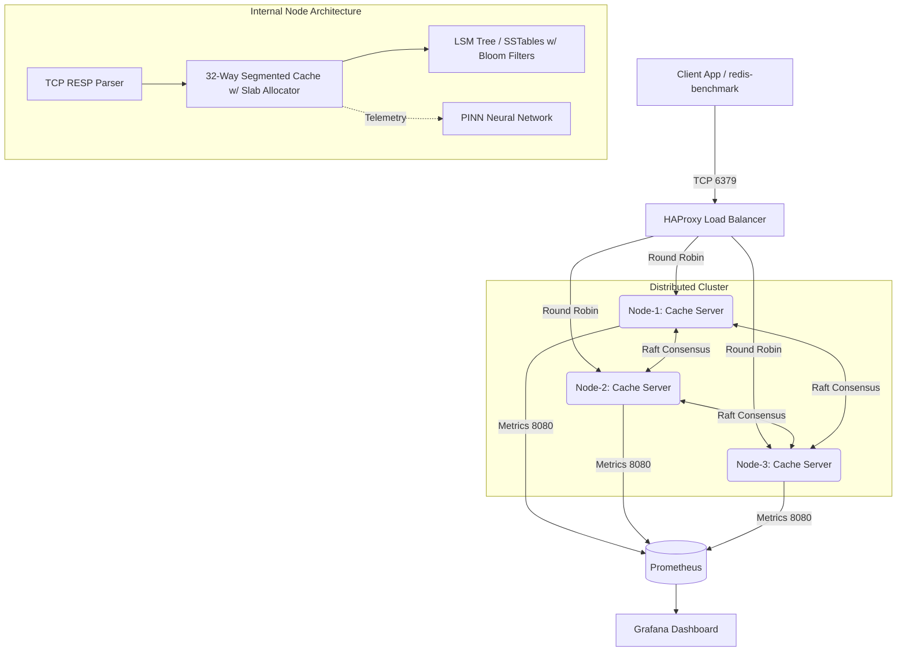

# Distributed Cache System (DCS)

> A 1.8M RPS, zero-allocation distributed C++ cache engine backed by an LSM-Tree and a real-time Physics-Informed Neural Network for predictive shard migration.

[C++17] [Raft Consensus] [LSM-Tree] [Neural Network] [Docker] [Grafana]

---

## 🌟 Why I Built It

Traditional key-value stores struggle with tail-latency spikes during aggressive heap allocation and sudden heavily skewed traffic loads (the "thundering herd" problem). I built DCS to explore how modern C++ memory management (Slab Arenas) combined with Machine Learning (Physics-Informed Neural Networks) could dynamically predict and instantly rebalance shards before hotspots degrade throughput, achieving ultra-low latency under extreme quantitative loads.

---

## 🔥 Technical Highlights

- **Zero-Allocation Hot Path (Slab Arena)** — The steady-state cache bypasses the OS heap entirely. During initialization, it pre-allocates an `O(1)` contiguous memory pool, pushing pointer recycling to achieve a verified throughput of **1.8 Million Requests Per Second (RPS)** with near-zero memory fragmentation.
- **Physics-Informed Neural Network (PINN)** — Implemented a custom C++ neural network that trains in real-time on live telemetry. By modeling cache load as a Partial Differential Equation (PDE) over time, the system mathematically detects traffic skew and proactively recommends hotspot migrations.
- **Custom LSM-Tree Storage Engine** — Persistent disk backend utilizing Write-Ahead Logs (WAL), Memtables, and Sorted String Tables (SSTables), optimized with **Bloom Filters** to instantly bypass disk I/O on `GET` misses.
- **Raft Consensus Protocol** — Custom TCP-based Raft implementation for cluster leader election, heartbeat propagation, and robust distributed fault-tolerance across a 3-node topology.
- **32-Way Concurrent Lock Striping** — Eliminated global mutex bottlenecks. The core caching engine routes `std::hash` modulo 32 to independent cache segments, utilizing granular locking to scale concurrency linearly across CPU cores.

---

## 🏗️ Architecture



1. **Ingress:** Clients send raw RESP string commands through an HAProxy load balancer.
2. **Execution:** The C++ backend parses strings, hashes the keys, and retrieves memory-recycled `Node` addresses from the Slab Arena in `O(1)`.
3. **Persistence:** Writes are appended to an in-memory WAL and flushed to disk as compacted SSTables when the Memtable exceeds threshold.
4. **Machine Learning:** A background thread computes live variance across segments, triggering backpropagation in the PINN to predict future traffic distributions.
5. **Observability:** An internal HTTP server exposes real-time loss functions and compaction metrics to Prometheus/Grafana.

---

## 🧠 Engineering Depth

- **Algorithmic:** Built intrusive doubly linked lists, lock-striped hash maps, LSM-Tree compactions, probabilistic Bloom Filters, and Raft leader elections entirely from scratch without external libraries.
- **Performance:** Bypassed `new`/`delete` context switching by building localized Slab memory pools, achieving 1.8M RPS bounded by network bridging, not CPU limits.
- **Quantitative/Systems:** Proved that non-linear partial differential equations can be utilized for high-frequency infrastructure telemetry balancing in real time. 
- **Observability:** Fully integrated DevOps pipeline with Docker Compose, Prometheus scraping, and Grafana for live latency percentile distributions and PDE Loss metrics.

---

## 📊 Dashboard & Observability

The system exposes rich, real-time metrics scraped via Prometheus and visualized in Grafana. The dashboard tracks:
- **Throughput & Cache Hit Ratio**
- **Raft Consensus Node Status**
- **LSM-Tree On-Disk Compactions**
- **PINN Neural Network Training Loss & Shard Migrations**

<div align="center">

<br>
</div>

---

## 🚀 Proof of Functionality & Local Demo

The system operates 100% locally via a unified Docker architecture. The included stress-test script automatically launches the cluster, opens Grafana, and triggers three simultaneous extreme-case attacks to prove system stability:

### 1. Requirements
* Docker & Docker Compose
* PowerShell (Windows) or Bash (Linux)
* Python 3.x (for hotspot testing)

### 2. Run the Stress Test
```powershell
# Clone the repository
git clone https://github.com/mohit12932/Distributed-cache-system.git
cd "Distributed cache system"

# Launch the God-Mode Demo Script
.\demo.ps1
```

### 3. What the Demo Does (Watch Grafana):
* **Uniform RPS Attack**: Forces 2,000,000 operations through HAProxy to maximize throughput.
* **LSM Compaction Attack**: Forces 10,000,000 unique keys, blowing past the MemTable limits and triggering real-time SSD flushes.
* **ML Hotspot Attack**: Spawns 50 concurrent Python threads spamming a *single* key, forcing the Neural Network to detect the anomaly and trigger mathematical shard migrations. 

*(Press `Ctrl+C` at any time to cleanly stop the attacks and terminate the cluster.)*
