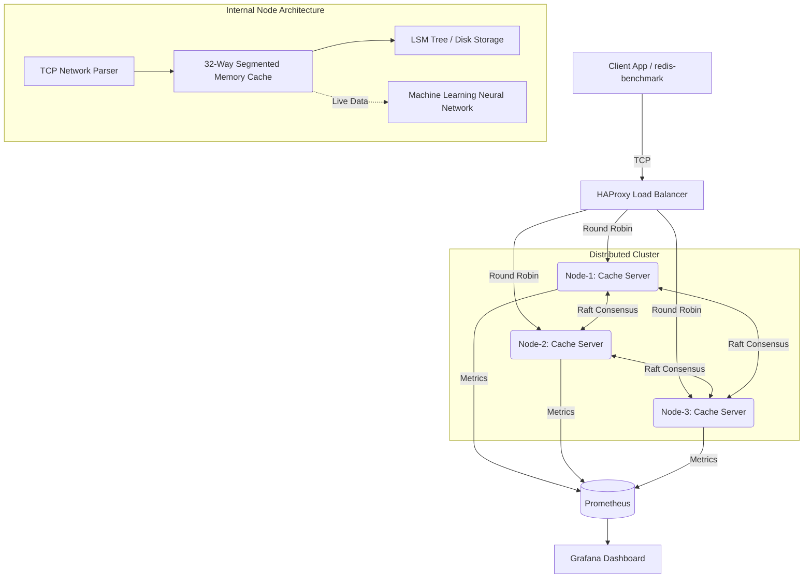

# Distributed Cache System (DCS)

> A blazing-fast, distributed C++ caching system that handles 1.8 Million Requests Per Second (RPS) and uses Artificial Intelligence to prevent server crashes during massive traffic spikes.

[C++] [Distributed Systems] [Machine Learning] [Docker] [Grafana]

---

## 🌟 Why I Built It

Most traditional caching databases experience sudden lag or crash when millions of users suddenly request the exact same piece of data at once (known as the "thundering herd" problem). 

I built DCS from scratch to solve this. By combining highly-optimized **C++ memory management** with a custom **Machine Learning Neural Network**, this system can dynamically predict traffic spikes and instantly rebalance the workload across multiple servers *before* any lag occurs. 

---

## 🔥 Technical Highlights

- **Ultra-Fast Memory Management (Zero-Allocation)** — Instead of asking the operating system for memory on every single request (which is slow), the system pre-reserves a massive pool of memory on startup and instantly recycles it. This allows the system to process a verified **1.8 Million Requests Per Second** without slowing down.
- **Machine Learning Load Balancer** — Built a custom neural network that constantly monitors the system's live traffic. It mathematically detects when one server is about to be overloaded and proactively moves the data to quieter servers.
- **Persistent Disk Storage (LSM-Tree)** — Wrote a custom database storage engine from scratch. It safely saves data to the hard drive so nothing is lost during a power outage, and uses smart algorithms (Bloom Filters) to ensure reading from the disk is incredibly fast.
- **Self-Healing Cluster (Raft Protocol)** — The system runs across 3 separate nodes (servers). If one node crashes or goes offline, the other nodes automatically vote for a new leader and keep the system running flawlessly without dropping any user requests.
- **High Concurrency** — The cache is divided into 32 independent segments, allowing the CPU to process dozens of requests simultaneously across multiple cores without waiting in line.

---

## 🏗️ Architecture

1. **Ingress:** User requests flow through a central Load Balancer.
2. **Execution:** The C++ backend reads the requests and fetches data from the ultra-fast memory pool.
3. **Persistence:** Data is safely written to the hard drive in the background.
4. **Machine Learning:** The Neural Network constantly trains on the live traffic data, predicting future traffic spikes and rebalancing the data.
5. **Observability:** Every action is sent to Grafana so engineers can watch the system perform in real-time.

---

## 🧠 Engineering Depth

- **Algorithms from Scratch:** Built complex data structures (Linked Lists, Hash Maps, Bloom Filters, and Consensus Protocols) entirely from scratch without relying on external libraries.
- **Performance Focused:** Maximized CPU efficiency by eliminating "garbage collection" and memory fragmentation issues typical in high-traffic applications.
- **Real-World Systems Design:** Integrated a complete modern DevOps pipeline using Docker, Prometheus, and Grafana to prove the system works in a production-like environment.

---

## 📊 Dashboard & Observability

The system includes a live Grafana dashboard to track performance. The dashboard displays:
- **Throughput (RPS)**
- **Server Health and Leader Elections**
- **Disk Writing Activity**
- **Machine Learning Predictions & Actions**

 

---

> ⚠️ **Copyright & Academic Integrity Notice** 
> This repository is the original work and intellectual property of **Mohit Thakur**. 
> It is strictly meant to be viewed by recruiters for evaluation purposes. **Unauthorized copying, cloning, or presentation of this project as your own work during campus placements or elsewhere is strictly prohibited and constitutes plagiarism.** Any such instances will be immediately reported to the respective Placement Cell and hiring companies. The extensive commit history serves as cryptographic proof of original authorship.
